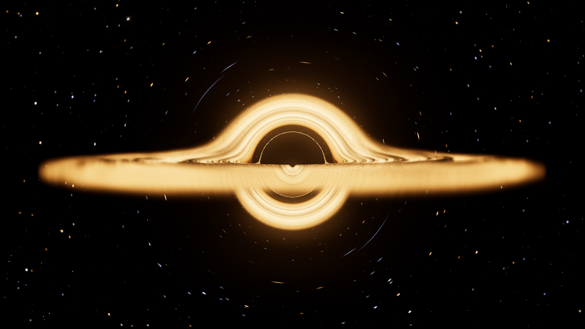
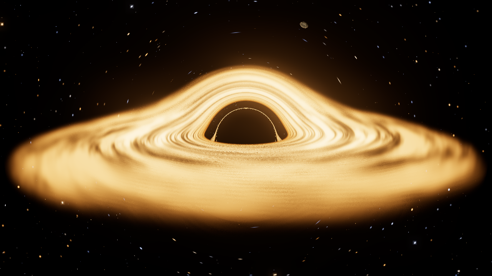
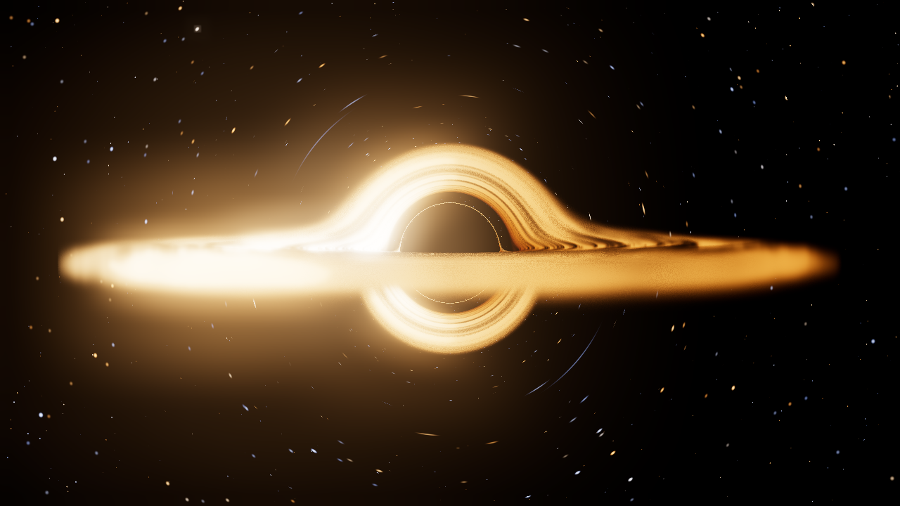
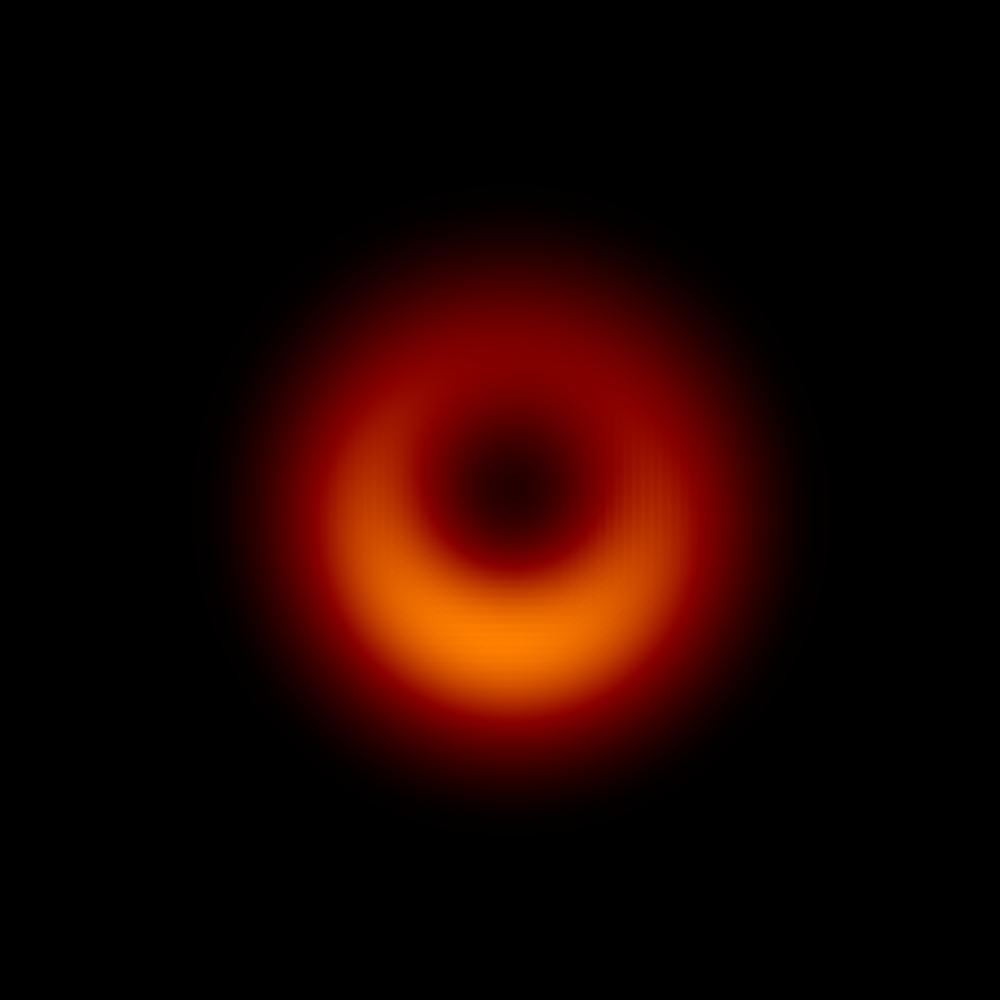

# Schwarzschild

A real-time black hole simulator that runs in the browser. Every pixel is a photon
traced backwards through curved spacetime by integrating the exact null geodesic
equation of the Schwarzschild metric on the GPU — no lensing approximations, no
faked bending.

**▶ [Open the simulator](https://dec3ptor.github.io/BlackHoleSIm/)**

> **First-time setup:** the link above goes live once GitHub Pages is switched on for
> this repository — **Settings → Pages → Build and deployment → Source → GitHub
> Actions**. That is a one-off click that only a repository admin can make; the workflow
> token is not allowed to do it. After that every push to the default branch deploys
> automatically. Until then you can still run it locally (see below).







---

## What it actually computes

The renderer solves the Binet equation for light in Schwarzschild spacetime,

```
d²u/dφ² = −u + 3Mu²          where u = 1/r
```

with a fourth-order Runge–Kutta step per sample, once per pixel, every frame. Drop the
`3Mu²` term and you get exact straight lines — which is what the **Curved spacetime**
toggle does, so you can see precisely what general relativity adds and nothing else
changes.

That single equation, integrated honestly, produces:

- **The shadow**, with an angular radius set by the critical impact parameter
  `b = 3√3 M ≈ 5.196 M`. Nothing else goes into it.
- **The photon ring** at the shadow's edge, where light winds around the hole before
  escaping, and the higher-order images of the disc packed just inside it.
- **Einstein rings** — a source directly behind the hole images as a complete ring. The
  renderer puts the first one at 15.857°, against 15.897° from integrating the geodesic
  equation independently: **0.25%**. Higher orders pile up onto the photon ring exactly as
  they should, the second at 1.0012× the shadow radius and the third at 1.0000×.
- **The folded disc**: the far side of the accretion disc lifted up over the top of the
  hole and wrapped underneath it, because the light from it bends around.

### The accretion disc

The disc is a **volume, not a surface**. Each ray marches through a flared slab of gas
with a Gaussian vertical profile, solving emission and absorption step by step. Two
components share the slab: hot gas that emits and absorbs, and cooler dust that only
absorbs — which is what draws the dark lanes across the bright gas behind them. Because
opacity is density-dependent, thin wisps glow and let the far side of the disc show
through while dense strands block it, so both lensed arcs stay visible at once.

Its structure is fractal noise sampled in the **co-rotating frame**, azimuth minus
Ω(r)·t. Nothing scrolls it: Keplerian shear winds it into trailing spirals by itself,
the inner disc lapping the outer one exactly as fast as Ω ∝ r^(-3/2) requires.

The gas emits as a black body at the standard effective temperature profile

```
T(r) ∝ [ (1 − √(r_in/r)) / r³ ]^(1/4)
```

peaking at `r = (49/36) r_in`, and coloured by integrating **Planck's law against the
CIE 1931 colour-matching functions** — not by a colour ramp. The same code prints the
physical peak temperature and the band it falls in, so Cygnus X-1's disc correctly comes
out at a few million kelvin in soft X-rays.

Light from the disc carries the full frequency shift

```
g = √(1 − 3M/r) / [ √(1 − 2M/r_obs) · (1 + Ω b n_y) ]
```

computed from the emitter's four-velocity on its circular geodesic, with the observed
intensity following as `g⁴`. That is why one limb of the disc is fiercely bright and blue
while the other is dim and red — and why flipping the disc's rotation mirrors the image
exactly.

### Orbits and worlds

Planets are lit only by the accretion disc, so the terminator always faces the hole, and
they are tidally locked — which anything orbiting this close would be. They are lensed
with everything else, so a planet passing behind the hole can appear twice.

Test particles move on real timelike geodesics,

```
d²r/dτ² = −M/r² + L²/r³ − 3ML²/r⁴
```

integrated in proper time and stepped so that every particle shares one coordinate-time
clock. They precess, they have an innermost stable circular orbit at exactly 6 `r_g`, and
inside it they spiral in and are lost. Built-in scenarios cover perihelion precession, the
ISCO and the plunge, a relativistic zoom-whirl orbit with no Newtonian analogue, and an
inclined S-star cluster.

### The spacetime view

Flamm's paraboloid, `z = 2√(r_s(r − r_s))` — the genuine isometric embedding of the
equatorial slice, not a rubber-sheet cartoon. It meets the horizon vertically and flattens
off as `√r`. A fan of null geodesics can be overlaid, straddling the critical impact
parameter so you can watch capture begin. The surface really is that shallow; the depth
slider exaggerates it for legibility and 1.00× is the truth.

## M87*, the real photograph

The **M87* — the EHT image** preset reconstructs the first photograph of a black hole
rather than imitating it. The emission is optically thin synchrotron from a hot,
geometrically thick flow, integrated along each ray with no absorption — the physics that
applies at 230 GHz. It lands on the measured numbers:

| Quantity | This simulation | Event Horizon Telescope, 2019 |
| --- | --- | --- |
| Angular scale | 3.82 µas per r_g | 6.5×10⁹ M☉ at 16.8 Mpc |
| Shadow / ring diameter | 39.7 µas | 42 ± 3 µas ring |
| Ring : depression flux | 10.5 : 1 | ~10 : 1 |
| Bright side position angle | 178° east of north | 150°–200° |
| Beam | 20 µas FWHM | ~20 µas |

The asymmetry is not painted on. Set the **beaming exponent** to zero and the ring becomes
perfectly symmetric — it is the `g³` Doppler boost of plasma orbiting at a large fraction
of c, seen 17° off the jet axis, which is exactly the EHT's own explanation. Turn the beam
down to zero to see the razor-thin photon ring underneath the array's resolution.



## Matching the film

The **Gargantua (film)** preset targets the look of *Interstellar*, and it gets there
partly by switching **Doppler beaming off** — which is what the film did too. With beaming
on, one limb runs several times brighter and bluer and the famous symmetry disappears;
turn the slider up to see what a camera would actually record. The preset also flattens
the temperature law towards isothermal, which is how the film kept the disc glowing evenly
out to the rim rather than collapsing into a bright inner ring. Both are exposed as
controls rather than baked in, so you can slide between the film and the physics — and the
**Gargantua + Doppler beaming** preset is the same disc with the omission put back, which
is what a camera would really record.

Sources: [CERN Courier on building Gargantua](https://cerncourier.com/a/building-gargantua/),
[James, von Tunzelmann, Franklin & Thorne, *Class. Quantum Grav.* **32** 065001](https://iopscience.iop.org/article/10.1088/0264-9381/32/6/065001),
[EHT Collaboration, *First M87 EHT Results I*](https://arxiv.org/abs/1906.11238),
[EHT Results V: physical origin of the asymmetric ring](https://ui.adsabs.harvard.edu/abs/2019ApJ...875L...5E/abstract),
[orientation of the crescent image of M87*](https://www.aanda.org/articles/aa/full_html/2020/02/aa36586-19/aa36586-19.html).

## What is deliberately not simulated

- **The hole does not rotate.** This is Schwarzschild, not Kerr: no frame dragging, no
  ergosphere, no spin parameter. M87*'s ring is thought to be spin-influenced, so the
  reconstruction here matches its size, contrast and asymmetry but not the detailed
  shape a spinning model would give.
- **No plunging-region dynamics.** Inside the ISCO there is no circular geodesic, so the
  frequency shift is frozen at its r = 6 value rather than following the real infall.
- **The camera is a static observer**, so there is no aberration from its own motion.
- The disc is geometrically thin and optically parameterised; there is no radiative
  transfer, no self-heating and no magnetohydrodynamics.
- Rays that spiral many times at the photon sphere are cut off at the step limit and
  treated as captured, which is where the overwhelming majority of them end up.

## Verification

The physics is not taken on trust. `tests/physics.test.mjs` pins the integrators against
closed-form general relativity:

| Test | Reference |
| --- | --- |
| Light deflection, weak field | `4M/b + 15πM²/4b²` |
| Light grazing the Sun | 1.7512 arcsec |
| Capture threshold | `b = 3√3 M`, diverging deflection |
| Turning point of a grazing photon | the photon sphere at `r = 3M` |
| ISCO constants | `L = 2√3`, `E = √(8/9)`, `v = c/2` |
| Marginal stability | `d²V/dr²` changes sign at exactly `r = 6M` |
| Perihelion precession | `6πM / a(1 − e²)`, and Mercury's 43″/century |
| Doppler asymmetry | approaching limb blueshifted, mirrored under spin flip |
| Flamm embedding | vertical at the horizon, asymptotically flat |
| Black-body colour | CIE Illuminant A and the Planckian locus to <0.004 in xy |

```bash
npm test          # node --test tests/
```

The GPU integrator in `src/render/lensingShader.js` is a line-for-line transcription of
the tested CPU integrator in `src/core/geodesics.js`, including the escape-radius choice,
which has its own regression test.

## Running it locally

No build step and no dependencies to install — three.js is vendored in `vendor/`, so the
page works offline and nothing is fetched from a CDN.

```bash
git clone https://github.com/Dec3ptor/BlackHoleSIm.git
cd BlackHoleSIm
npm start          # or: python3 -m http.server 8080
```

Then open <http://localhost:8080>. It needs a browser with WebGL 2.

### Deploying your own copy

`.github/workflows/pages.yml` runs the test suite on every branch and publishes the
default branch to GitHub Pages — whatever that branch is called, so renaming it is safe.
Set **Settings → Pages → Build and deployment → Source** to **GitHub Actions** once, then
re-run the latest workflow; every later push deploys on its own.

## Controls

| Key | Action |
| --- | --- |
| drag / scroll | orbit and zoom |
| `V` | switch between the relativistic and spacetime views |
| `G` | toggle curved spacetime |
| `D` | toggle the accretion disc |
| `space` | pause |
| `H` | hide the interface |
| `P` | save a PNG |
| `F` | fullscreen |

Performance scales by resolution, not by physics: the renderer drops the render scale to
hold frame rate and never reduces the integration accuracy behind your back. Both are
exposed under **Quality**.

## How accurate is the lensing of the stars?

The deflection is exact and the magnification follows from it, because magnification *is*
the Jacobian of the sky mapping — get the mapping right and the magnification comes free.
Measured against an independent integration: the first Einstein ring lands within 0.25%
(above). Surface brightness is conserved automatically, since the sky is a function
sampled at the deflected direction, and that makes the flux magnification come out right
too.

Two honest caveats:

- **The stars are not point sources.** Each is a disc a few pixels across — about 13
  arcminutes, roughly the Moon. Real stars are under 0.05 arcsec, so they are ~10⁵ times
  smaller. This is not a modelling shortcut that could be removed: at any sane field of
  view a pixel already subtends several arcminutes, so a star *cannot* be drawn at its
  true size. The consequence is that a lensed star stretches into a visible arc at
  constant surface brightness, where a real point source would stay point-like and simply
  brighten by the magnification factor. The total flux is the same either way — only its
  distribution differs.
- **Near the shadow the sky is compressed enormously**, and the higher-order images there
  are demagnified by ~10⁻⁵. Point-sampling one direction per pixel used to draw those at
  full surface brightness, which showed up as bright single-pixel speckle hugging the
  shadow edge. The star field is now filtered by the pixel's sky footprint, measured from
  screen-space derivatives: where a pixel spans more sky than a star subtends, the star is
  widened to the footprint and dimmed by the area ratio, which is what a mip level does.
  Speckle at the shadow edge went from a peak of 143/255 to 4/255 with the open sky
  unchanged (luminance 0.560 → 0.559).

Light never appears *inside* the shadow: a ray that crosses the horizon returns the
emission it gathered on the way in and nothing else. Measured on a starfield-only render,
the shadow interior is exactly zero — not one pixel above black. Anything that looks like
a star in front of the hole is either disc emission genuinely in front of it, or the
optically thin outer disc letting the background through, which is correct for a medium
of that density.

## Performance

Every pixel is an independent curved-spacetime ray trace, so this is pure GPU
fragment-shader work — there is no CPU path to move off, and nothing to gain from
WebGPU, which would change the API rather than the arithmetic. Making it faster means
doing less per pixel.

Profiling the frame (by stubbing functions in the live shader and timing) put the cost
in a surprising place:

| | Share of frame |
| --- | --- |
| Procedural star field | 42% |
| Disc noise (fbm) | 38% |
| Geodesic integration — the actual physics | 31% |

So the physics was the cheap part. Three changes, none of which touch it:

- **Disc noise now comes from a 3D texture.** White noise read back with hardware linear
  filtering *is* value noise — the texture unit does the interpolation the shader was
  doing with eight hashes per octave. Measured effect on the image: detail ×0.978, i.e.
  nothing.
- **The star field samples 8 lattice cells instead of 27.** A star's reach is held below
  half a cell, so the other nineteen could never contribute. The densities are 1.64×
  the naive area scaling, because the old 27-cell sweep quietly drew stars from three
  radial shells and eight cells span two — measured against the old render rather than
  assumed.
- **Sky-only rays skip the position maths.** Two transcendentals and a square root per
  step were being computed for every ray, but are only needed by rays that reach the
  disc or a planet. Most pixels are sky.

Net: **1.83× faster**, with mean luminance within 1.7% and fine detail at 94% of the
original — the remainder being star *placement*, not lost structure.

If it is still heavy, the order to reach for:

1. **Max pixel ratio** (Quality panel). A Retina screen reports 2, which is four times
   the pixels to trace. The default caps it at 1.5; 1.0 is another 2.25× and, under
   bloom, hard to tell apart.
2. **Adaptive resolution** is on by default and trades pixels for frame rate — never
   integration accuracy — dropping scale in proportion to how far over budget a frame is.
3. **Integration steps** only matter for rays near the shadow; most escape long before
   the cap, which is why halving it barely moves the frame time.

## Layout

```
index.html                       page shell, import map, about panel
src/core/units.js                constants and black-hole scaling relations
src/core/geodesics.js            null and timelike geodesic integrators
src/core/blackbody.js            Planck → CIE → linear sRGB
src/render/lensingShader.js      the GPU geodesic tracer
src/render/blackHoleView.js      uniforms and the black-body lookup texture
src/render/spacetimeView.js      Flamm's paraboloid, orbits, light rays
src/sim/simulation.js            state, presets, scenarios, particle dynamics
src/ui/                          control panel and readouts
tests/physics.test.mjs           the table above
vendor/three/                    three.js r169, MIT
```

## Licence

MIT — see [LICENSE](LICENSE). Bundles three.js, also MIT.
